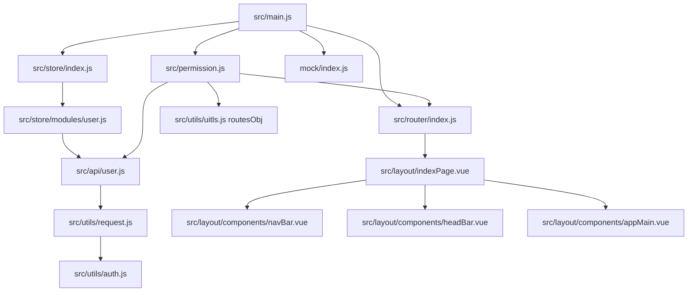

# zlm-video-admin 项目代码索引与架构说明

## 1. 项目整体架构概览

本项目是一个 `Vue2 + Vue Router + Vuex + Ant Design Vue` 的流媒体管理前端，围绕 ZLMediaKit 的 HTTP API 与多协议播放能力构建。

- UI 框架与运行时：`Vue 2.7.16`、`ant-design-vue 1.x`
- 状态管理：`Vuex`
- 路由管理：`Vue Router`（含登录后动态注入路由）
- 网络请求：`axios`
- 流媒体播放：`flv.js`、`mpegts.js`、`DPlayer`、`Jessibuca`、`wsPlayer`
- 图表监控：`echarts`
- 登录/菜单模拟：`mockjs`

### 1.1 分层结构

- 启动层：`src/main.js`
- 应用壳层：`src/App.vue`、`src/layout/*`
- 路由与权限层：`src/router/index.js`、`src/permission.js`
- 状态层：`src/store/*`
- API 层：`src/api/user.js`、`src/api/zlm.js`
- 请求封装层：`src/utils/request.js`、`src/utils/auth.js`
- 页面与业务组件层：`src/views/*`
- Mock 数据层：`mock/*`

### 1.2 启动与运行主链路

1. `src/main.js` 初始化 Vue，注册 Ant Design、Vuex、Router，加载 `permission` 与 `mock/index`。
2. `src/permission.js` 在路由守卫中完成 token 校验、用户信息拉取、动态菜单路由注入。
3. `src/layout/indexPage.vue` 作为登录后的主框架（侧边菜单 + 头部 + 内容区）。
4. `src/layout/components/navBar.vue` 从 `router.options.routes[2].children` 渲染菜单。
5. 页面组件按功能调用 `src/api/zlm.js` / `src/api/user.js`，再通过 axios 与后端（或 mock）通信。

## 2. 代码文件依赖关系

## 2.1 核心依赖图（启动/鉴权/路由）

## 2.2 业务依赖图（ZLM 业务）

## 2.3 路由数据依赖

- 路由菜单接口：`src/api/user.js` 的 `routerList()`
- mock 路由数据来源：`mock/router.js`
- 动态路由转换：`src/utils/uitls.js` 的 `routesObj()`
- 注入位置：`src/permission.js` 使用 `router.addRoute('home', ...)`

## 3. 功能模块调用逻辑

## 3.1 登录鉴权与用户态

1. 登录页 `src/views/login/indexPage.vue` 提交表单。
2. 调用 Vuex action：`user/login`（`src/store/modules/user.js`）。
3. `user/login` 调 `src/api/user.js` 的 `login()`，成功后写入 cookie token（`src/utils/auth.js`）。
4. 首次进入受保护路由时，`src/permission.js` 调 `user/getInfo` 与 `routerList()`。
5. 动态路由注入后跳转主页；退出登录由 `headBar.vue` 调 `user/logout`，重置路由与用户态。

## 3.2 动态菜单与页面渲染

1. `routerList()` 返回菜单树（当前由 `mock/router.js` 提供）。
2. `routesObj()` 将后端路由结构转成 `component: () => import(...)` 的前端路由对象。
3. `router.addRoute('home', route)` 动态挂载到主布局路由 `/` 下。
4. `navBar.vue` 读取 `router.options.routes[2].children` 渲染左侧菜单。

## 3.3 仪表盘模块

- 页面：`src/views/dashboard/indexPage.vue`
- 服务信息卡：`src/views/components/control/serveCardPage.vue`
  - 调用 `getServerConfig()` 获取服务端口、mediaServerId 等。
- 线程图表：`src/views/components/control/controlPage.vue`
  - 定时调用 `getThreadsLoad()`，使用 `echarts` 渲染延迟率/负载率曲线。

## 3.4 流服务管理模块

- 配置管理页：`src/views/zlm/set/setPage.vue`
  - 读配置：`getServerConfig()`
  - 改配置：`setServerConfig(params)`
- 流管理页：`src/views/zlm/stream/streamPage.vue`
  - 查询流：`getMediaList(params)`
  - 关流：`closeStreamsById(stream)`
  - 开启/停止 MP4 录制：`startRecordMp4()` / `stopRecordMp4()`
  - 弹窗协作：
    - `zlmPullDialog.vue` -> `addStreamProxy()`
    - `zlmPlayDialog.vue` -> 展示并复制流地址
    - `zlmMp4BackDialog.vue` -> `getMp4RecordFile()` 查询录像
    - `zlmFlvPlayerDialog.vue` -> 选择 HTTP-FLV 地址播放并重连

## 3.5 直播播放模块（多协议示例）

- 多路 Jessibuca：`src/views/video/mainPlayerPage.vue`
  - 基于 `getBaseUrl(2)` 组装 ws-flv 地址，支持 1/4/9 宫格、全部播放/暂停。
- FLV + DPlayer：`src/views/video/flv/dPlayerPage.vue`
  - `flv.js` 与 DPlayer 结合。
- FMP4（wsPlayer）：`src/views/video/fmp4/webSocketPage.vue`
  - `window.wsPlayer` 打开 `*.live.mp4`。
- TS（mpegts.js）：`src/views/video/ts/mpegJsPlayer.vue`
  - `mpegts.createPlayer` 实时播放 `*.live.ts`。

## 3.6 回放与点播模块

- 硬盘录像机回放：`src/views/video/back/boxBackPlayerPage.vue`
  - 通过 `addStreamProxyBack()` 把回放 RTSP 代理成可播流，再由 Jessibuca 播放。
  - 通过 `closeStreamsByApp('tracks')` 管理回放代理流。
- 流媒体点播页：`src/views/vod/vodPlayerPage.vue`
  - 基于 `flv.js` 的播放控制、统计与重连机制。
  - 当前页面内含独立推流服务接口常量（`STREAM_API_BASE` 等），与 `api/zlm.js` 解耦。

## 4. 关键代码文件定位索引

| 分类 | 文件 | 作用 | 关键说明 |
| --- | --- | --- | --- |
| 启动入口 | `src/main.js` | 应用初始化 | 挂载 router/store、加载权限守卫与 mock |
| 顶层容器 | `src/App.vue` | 全局容器 | `a-config-provider` + `router-view` |
| 路由定义 | `src/router/index.js` | 静态路由与 resetRouter | `/login`、`/404`、`/` 主布局 |
| 权限控制 | `src/permission.js` | 登录校验与动态路由注入 | `beforeEach` 中调 `user/getInfo` + `routerList` |
| 菜单转换 | `src/utils/uitls.js` | 后端路由转前端路由 | `routesObj()` 递归 `import('@/views...')` |
| 状态管理 | `src/store/modules/user.js` | 登录/登出/用户信息 | 与 `api/user.js`、`auth.js` 联动 |
| 请求封装 | `src/utils/request.js` | axios 拦截器 | 统一 token 注入与业务 code 判定 |
| 登录 API | `src/api/user.js` | 登录、用户信息、菜单接口 | 走 `request.js` 通道 |
| ZLM API | `src/api/zlm.js` | 流媒体与服务配置接口 | 提供 `getMediaList`、`setServerConfig` 等 |
| 主布局 | `src/layout/indexPage.vue` | 后台壳布局 | 组合头部、侧边栏、内容区 |
| 侧边菜单 | `src/layout/components/navBar.vue` | 动态菜单渲染 | 读取动态注入后的路由 children |
| 顶栏 | `src/layout/components/headBar.vue` | 面包屑与退出登录 | 调用 `user/logout` |
| 仪表盘页 | `src/views/dashboard/indexPage.vue` | 首页总览 | 聚合服务信息与线程图表 |
| 流管理页 | `src/views/zlm/stream/streamPage.vue` | 核心流操作页面 | 查询、拉流、录制、预览、播放、关流 |
| 配置页 | `src/views/zlm/set/setPage.vue` | ZLM 配置编辑 | 配置检索、过滤、修改 |
| 拉流弹窗 | `src/views/components/dialog/zlmPullDialog.vue` | 新增拉流代理 | 调 `addStreamProxy` |
| 播放弹窗 | `src/views/components/dialog/zlmFlvPlayerDialog.vue` | HTTP-FLV 播放器 | 自定义重连与状态监控 |
| 录像弹窗 | `src/views/components/dialog/zlmMp4BackDialog.vue` | MP4 录像查询 | 调 `getMp4RecordFile` |
| Mock 入口 | `mock/index.js` | mock 注册 | 注入 user/router mock |
| Mock 菜单 | `mock/router.js` | 动态菜单数据源 | 当前生效菜单: 仪表盘/点播/流管理 |

## 5. 当前路由与功能状态备注

- 当前默认菜单由 `mock/router.js` 返回，启用项主要是：`仪表盘`、`流媒体点播`、`流服务管理/流媒体管理`。
- `mock/router.js` 中存在已注释的“直播广场/直播回放/配置页”等路由模板，可按需恢复并联调对应页面。
- `src/main.js` 默认加载 `../mock/index`，即本地开发会优先使用 mock 登录与菜单数据。

## 6. 建议的阅读顺序

1. `src/main.js` -> `src/permission.js` -> `src/router/index.js`
2. `src/store/modules/user.js` -> `src/api/user.js` -> `mock/user.js`
3. `src/api/zlm.js` -> `src/views/zlm/stream/streamPage.vue` -> 各 `dialog/*.vue`
4. `src/views/dashboard/indexPage.vue` -> `src/views/components/control/*`
5. `src/views/video/*` 与 `src/views/vod/vodPlayerPage.vue`（按播放协议分类阅读）
